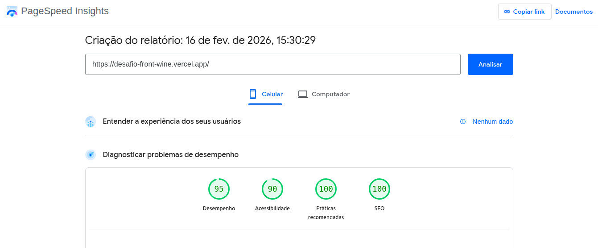

# Teste Técnico - Escoramento.com

Este projeto foi desenvolvido como parte do **Teste Técnico para Desenvolvedor Frontend**.

O objetivo foi reproduzir com fidelidade visual e estrutural da página inicial do site:

👉 https://escoramento.com

### Resultado final
👉 https://desafio-front-wine.vercel.app/

---

## 🎯 Objetivo

Recriar a **Home** do site com foco em:

 - Analisar uma interface real em produção
 - Reproduzir de forma mais fiel possível o layout e comportamento visual
 - Aplicar boas práticas de frontend (responsividade, organização de código e
performance)
 - Demonstrar atenção a detalhes de UI/UX

---

## 🧰 Tecnologias Utilizadas

- **Next.js 14**
- **TypeScript**
- **Tailwind CSS**

## 🚀 Como Rodar o Projeto
### 1️⃣ Clonar repositório
```bash
  git clone <git@github.com:andrelucca99/desafio_front.git>
```


### 2️⃣ Instalar dependências
```bash
  npm install
```


### 3️⃣ Rodar ambiente de desenvolvimento
```bash
  npm run dev
``` 

---

### 🧪 Testes - (Opcional)
- **Jest**
- **React Testing Library**

```bash
  npm run test
```
 ---

 ## Performance do site

 